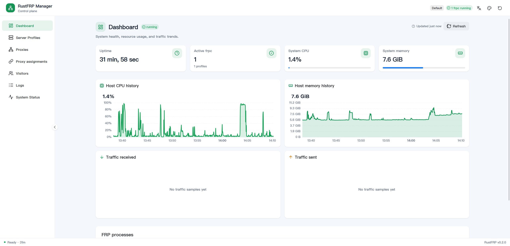
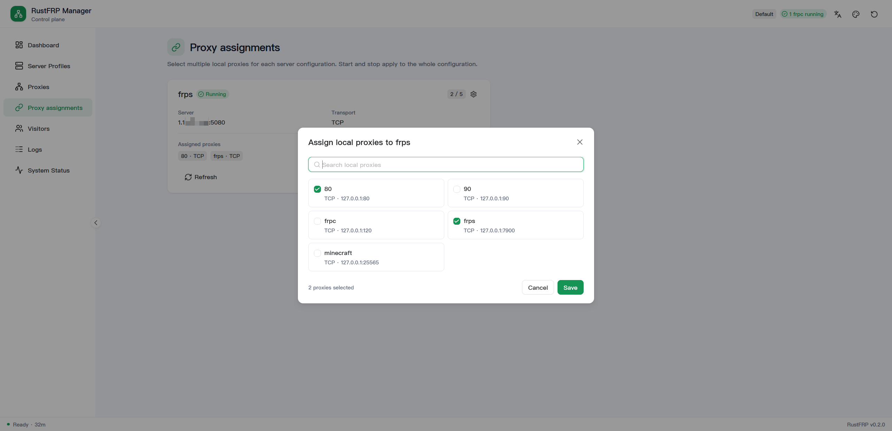
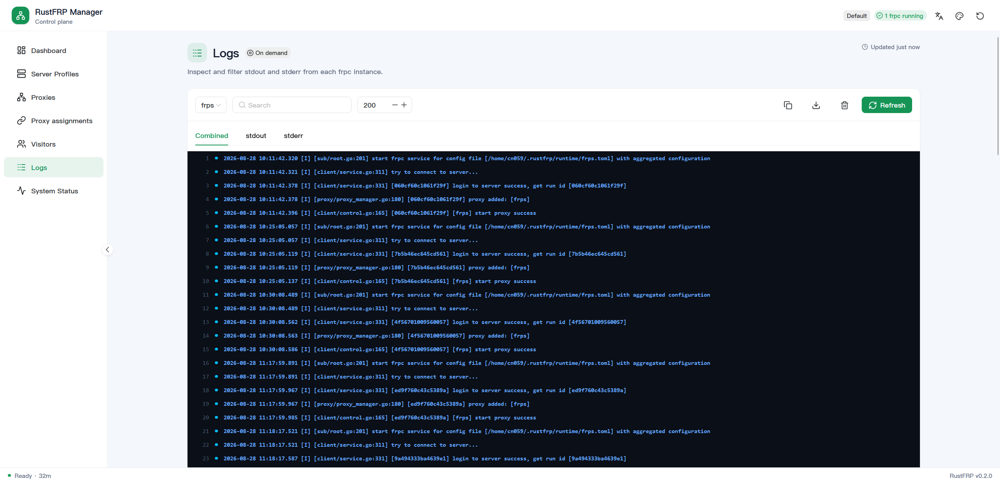

# RustFRP

[](LICENSE)
[](rust-toolchain.toml)
[](https://github.com/TATENcn/rustfrp/actions/workflows/webui-ci.yml)

> 用一个 Web 管理台配置、运行和监控 FRP，不再手写多份 TOML，也不必自己守着 frpc/frps 进程。

RustFRP 是面向个人、家庭实验室和团队运维的 FRP 管理工具。安装后打开浏览器，就能添加服务器、创建端口映射、启动穿透并查看运行状态。它兼容原生 FRP，不改变 FRP 协议，已有的 `frpc.toml` 也可以直接迁移进来。

## 新版 Web 管理界面

新版前端提供统一的中英文界面、响应式布局、实时运行状态、资源趋势图以及更清晰的配置工作流。

### 仪表盘



### 代理分配

每个服务器配置可以通过弹窗勾选多个本地代理，并在卡片上直接查看和控制运行状态。



### 日志控制台

日志支持实例切换、stdout/stderr 筛选、搜索、行数调整、复制和下载，并保留终端颜色。



## 你可以用它做什么

### 在网页中管理所有穿透配置

- 在中英文 WebUI 中管理服务器、代理、绑定关系和访客配置。
- 支持 TCP、UDP、HTTP、HTTPS、STCP、XTCP、SUDP 和 TCPMUX。
- 支持 Token、OIDC、FRP `user` 和 Visitor `serverUser`。
- 一键复制映射后的访问地址。
- 从端口列表或范围一次创建最多 100 个 TCP/UDP 映射，并自动检查端口冲突。
- 配置保存在 SQLite 中，RustFRP 自动生成原生 FRP TOML，日常使用无需手工维护配置文件。

### 同时运行多个 frpc

- 一个服务器配置对应一个独立 frpc 进程，可同时连接多个 frps。
- 支持启动、停止、重启、热重载和优雅退出。
- 进程崩溃后自动恢复，并通过指数退避避免陷入频繁重启。
- 自动归并重复故障，识别认证失败、网络不可达、配置错误、端口冲突和 TLS 错误。
- 单个连接发生故障不会影响其他正在运行的连接。

### 自动安装和切换 FRP 版本

- 首次使用自动下载适合当前系统的 frpc/frps，不依赖系统 `PATH`。
- 支持 Linux、Windows、macOS 的 x86_64 和 arm64。
- 下载内容强制使用 FRP 官方 SHA256 清单校验。
- 可以在 WebUI 中查看、安装、切换和删除多个 FRP 版本。
- 支持 GitHub 官方源和自定义 HTTPS 镜像；使用镜像时仍以官方校验和为准。
- 切换后启动失败会自动恢复原版本和原有进程。

### 迁移已有配置并随时备份

- 一次导入现有的现代格式 `frpc.toml`，包括服务器、代理、绑定和 Visitor。
- 导入过程使用数据库事务，失败时不会留下半套配置。
- 同名服务器配置会安全重命名，Proxy 和 Visitor 的对外名称保持不变。
- 随时下载一致性的 SQLite 备份，便于迁移、恢复和归档。

### 管理 frps 服务端

- 可选的 RustFRP Agent 从控制面安全拉取 `frps.toml` 并守护 frps。
- 新配置会先经过 TOML 检查和原生 `frps verify`，验证通过后才会生效。
- 控制面暂时不可用时继续运行最后一份有效配置。
- Agent 重启后可以接管已有 frps；Agent 自身退出不会连带终止 frps。

### 查看流量、进程和节点状态

- 仪表盘显示流量趋势、CPU、内存和 frpc 进程状态。
- 支持多个部署环境，并按环境查看配置和流量。
- 提供 Prometheus 指标以及预配置的 Grafana 仪表盘。
- 完整 Compose 部署包含 daemon、frps、control、Prometheus、Alertmanager 和 Grafana。
- 内置节点离线和控制面不可用告警，可继续接入邮件、Slack 或 Webhook。

### 按需要扩展和隔离权限

- 提供完整 REST API，适合脚本、自动化平台和二次开发。
- 简单部署可使用单个 API Token；团队部署可使用多身份策略文件。
- 支持租户隔离以及读、写、遥测和平台管理权限。
- Token 策略只保存 SHA256 摘要，并拒绝低强度凭据。
- Wasmtime 插件在无 WASI 沙箱中运行，带有权限、执行时间、计算量和内存限制。
- 内置故障切换、流量统计和 Webhook 通知参考插件。

RustFRP 的工作方式很简单：配置保存在 SQLite，运行时自动生成标准 FRP TOML，再由原生 frpc/frps 完成网络穿透。更深入的设计说明放在 [`AGENTS/`](AGENTS/) 中，不影响日常使用。

## 快速开始

### 使用 Docker Compose（推荐）

准备 API Token 和 Grafana 管理员密码，然后启动完整服务：

```bash
mkdir -p deploy/compose/secrets
openssl rand -hex 32 > deploy/compose/secrets/rustfrp_api_token.txt
export GRAFANA_ADMIN_PASSWORD='replace-with-a-long-password'
docker compose up -d --build
```

启动后可以访问：

| 服务 | 地址 | 用途 |
| --- | --- | --- |
| RustFRP | <http://127.0.0.1:7900/> | 配置和管理 FRP |
| Grafana | <http://127.0.0.1:3001/> | 查看集中监控仪表盘 |
| Prometheus | <http://127.0.0.1:9090/> | 查询监控指标 |
| Alertmanager | <http://127.0.0.1:9093/> | 查看和管理告警 |

Compose 会一并启动 RustFRP、frps、control 和监控组件。数据库、生成的配置、下载的 FRP 二进制及日志会保存在数据卷中；`/api/v1/health` 用于容器健康检查。完整参数和增加节点的方法见 [`deploy/compose/README.md`](deploy/compose/README.md)。

### 从源码运行

源码运行需要 Rust 1.88+、Bun，以及一个可用的 frps 服务端。首次启动还需要能够访问 FRP Release 下载源。

```bash
# 开发模式（前端热更新，需另开终端跑 daemon）
just dev-webui

# 直接运行 daemon（内嵌 WebUI + HTTP API）
just dev-daemon
# 等价于：
cargo run -p rustfrp-daemon

# 常用启动参数
cargo run -p rustfrp-daemon -- --config-dir ~/.rustfrp/runtime \
    --db-path ~/.rustfrp/config.db \
    --api-listen 127.0.0.1:7900          # 默认仅本机；对外开 0.0.0.0:7900
    --api-token <token>                   # 建议生产环境开启鉴权
```

打开 <http://127.0.0.1:7900/> 即可使用 Web 管理界面。

### 使用流程

1. **服务器配置** — 填你的 frps 地址、端口、token（支持 token / OIDC 鉴权）
2. **代理规则** — 定义要穿透的本地服务（tcp / udp / http / https / stcp / xtcp 等）
3. **绑定关系** — 把服务器配置和代理规则关联，启用并启动
4. 访问穿透出的地址验证

### 配置迁移与备份

系统状态页可以将现代格式的 `frpc.toml` 一次性导入 SQLite，包含 Profile、
Proxy、Binding 和 Visitor。导入使用单个数据库事务，同名 Profile 会自动添加
数字后缀；Proxy/Visitor 名称保持不变，以免改变 FRP 对外名称。导入的绑定默认
处于待启动状态。

同一页面可以下载一致性的 `.sqlite` 备份。备份包含认证 token 等敏感配置，
应按密钥文件保管，不要提交到 Git 或通过公开渠道传输。

对应 API：

```text
POST /api/v1/config/import
GET  /api/v1/config/export
```

frpc 二进制会在首次启动时自动就绪，无需手动安装。

## 二进制自托管

| 项 | 说明 |
|---|---|
| 下载来源 | fatedier/frp GitHub Releases |
| 落地目录 | `~/.rustfrp/frp/frpc` |
| 版本控制 | 环境变量 `RUSTFRP_FRP_VERSION` 覆盖默认版本 |
| 平台探测 | 自动匹配 `linux_amd64` / `linux_arm64` / `darwin_*` / `windows_*` |

## 项目结构

```
crates/
├── client/           # 核心库：SQLite CRUD、TOML 生成、进程守护
├── rustfrp-bin/      # FRP 二进制下载/校验/解压（自托管）
├── rustfrp-daemon/   # HTTP API + 内嵌 WebUI
├── rustfrp-sdk/      # 插件 SDK（占位）
├── common/           # 共享：信号、日志、插件管理器、错误
└── server/
    ├── control/      # 监控服务器（Pull 模式指标采集）
    └── agent/        # 服务端 frps 配置 Pull、校验、缓存与进程守护
plugins/
└── webui/            # Vue 3 + Vite + naive-ui 管理界面
```

## 文档

项目设计文档在 [AGENTS/](AGENTS/) 目录：

- [01-ARCHITECTURE](AGENTS/01-ARCHITECTURE.md) — 系统架构与 ADR
- [02-CONSTRAINTS](AGENTS/02-CONSTRAINTS.md) — 硬性约束
- [03-DEVELOPMENT](AGENTS/03-DEVELOPMENT.md) — 开发规范
- [05-CICD](AGENTS/05-CICD.md) — CI/CD 与发布
- [06-DEPLOYMENT](AGENTS/06-DEPLOYMENT.md) — 部署指南
- [07-UI-DESIGN](AGENTS/07-UI-DESIGN.md) — UI 设计
- [08-SECURITY](AGENTS/08-SECURITY.md) — 安全

## 开发

贡献代码请从默认分支 `dev` 创建短期分支，并向 `dev` 提交 PR。只有发布 PR
可以从 `dev` 合入 `main`，随后在 `main` 提交上创建版本 tag。完整规则见
[CONTRIBUTING.md](CONTRIBUTING.md)。

```bash
just test-fast        # 单元测试
just test-all         # 全量测试（含集成）
just lint             # fmt --check + clippy
just dev-webui        # 前端开发模式
just build-release    # 发布构建
```

## 测试

本地端到端穿透测试（双 frps + 双 frpc 闭环）：

```bash
bash scripts/e2e-local.sh
```

### 可选的 frps Agent

控制面以只读方式从模板目录提供 `<node-id>.toml`，Agent 使用 Bearer Token
主动拉取。候选配置会先通过 TOML 检查及 `frps verify`，成功后才原子替换
`frps.toml`；控制面不可用时继续使用最后有效缓存。Agent 退出或崩溃不会
杀死 frps，重新启动后会通过 PID 文件接管它。

```bash
export RUSTFRP_AGENT_TOKEN='replace-with-a-long-random-token'

# 控制面
cargo run -p rustfrp-control -- \
  --templates-dir ./deploy/agent/templates \
  --targets ./targets.json

# frps 节点；省略 --frps-path 时自动下载并校验官方 frps
cargo run -p rustfrp-agent -- \
  --node-id edge-1 \
  --control-url http://control.example.com:3000
```

模板 Pull API 支持 ETag/`If-None-Match`，节点 ID 仅允许字母、数字、短横线
和下划线，避免目录穿越。生产环境应在控制面前启用 TLS 反向代理。

### FRP 多版本管理

系统状态页可以查询官方稳定版本、从 GitHub 官方源或自定义 HTTPS 镜像安装、
切换和删除 FRP。安装目录按 `versions/<version>/<platform>/` 隔离，因此多个
版本可以同时存在。镜像只提供发布归档，SHA256 仍从 fatedier/frp 官方发布
清单获取。版本切换会重启切换前正在运行的 frpc；新版本启动失败时恢复原
版本和进程。也可以用 `RUSTFRP_FRP_VERSION` 指定守护进程启动版本。

## 许可证

[AGPL-3.0](LICENSE) © RustFRP contributors
